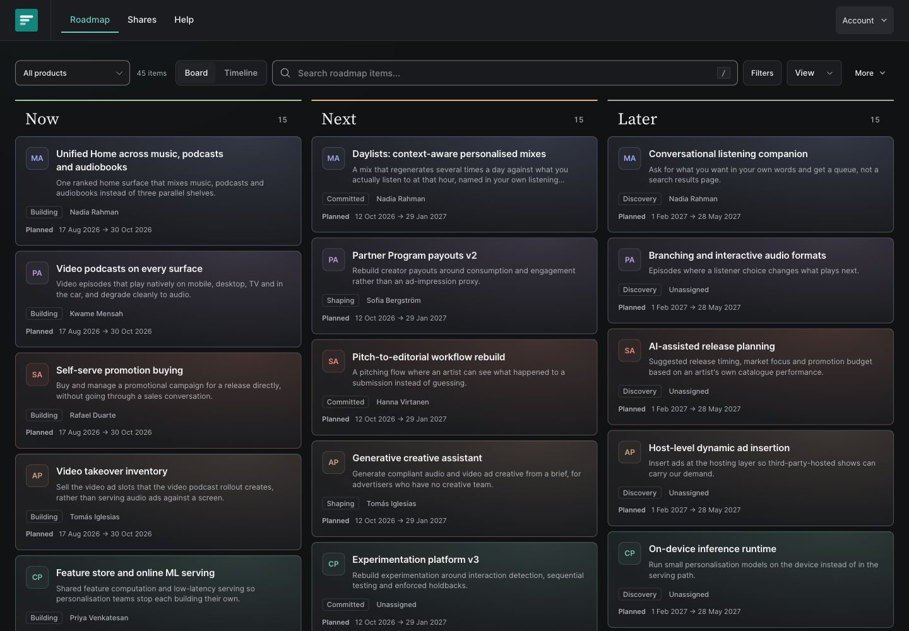
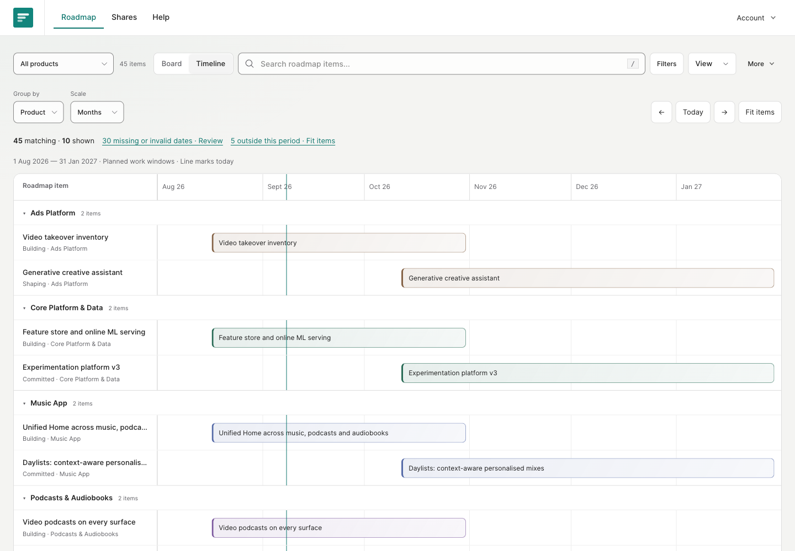
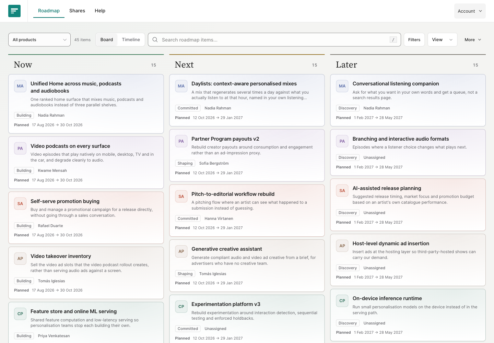

# Product Roadmap

**A roadmap you can read, plan and publish—with Git as the source of truth.**

Move between a Now / Next / Later board and a grouped timeline. Write the story behind each item, attach the evidence, and share a focused snapshot with the people who need it.

[Explore the showcase](https://roadmapdemo.canvas-drop.com/) · [Run locally](#run-locally) · [Configure editing](docs/self-hosting.md) · [Contribute](CONTRIBUTING.md)



## A board for priorities. A timeline for planned work.

- **One portfolio, two views.** Switch between the board and timeline without losing your filters. Group the timeline by product, owner, tag or stage. Items without both planned dates stay on the board, with a clear count of what the timeline omits.
- **Find the work that matters.** Search titles and descriptions; filter by product, stage, owner, tags and created/updated dates. Save named views in your browser.
- **Keep the context with the item.** Structured sections, Markdown, image previews, supporting documents and versioned attachments sit alongside the work.
- **Edit, review, then publish.** Recoverable drafts, conflict handling and a publication review separate work in progress from the committed roadmap. Publishing commits related items and uploaded files together.
- **Share deliberately.** Publish a standalone snapshot with selected resources. It retains its own content and appearance until explicitly republished.
- **Comfortable in either theme.** Product colors carry through cards, timelines and item details, with visible keyboard focus and layouts for desktop and mobile.



<details>
<summary>See the board in light mode</summary>



</details>

## About the showcase

The music portfolio is fictional: **60 items, five products, four supporting documents, and illustrative dates on 15 items**. Owner names, priorities and plans are demonstration content. Product names illustrate a music business; this project is not affiliated with or endorsed by Spotify.

The hosted showcase is available for browsing. GitHub write access is required to edit it. To try editing your own roadmap, use your own repository and editing service.

The screenshots above are actual application captures of the fictional dataset.

## Run locally

Requirements: **Node.js 24.15 or later (or 22.22.2+)**, npm, and Git. Go is only needed for the optional editing service.

```sh
git clone https://github.com/markpasternak/product-roadmap-generalized.git
cd product-roadmap-generalized
npm --prefix site ci
npm --prefix site run dev
```

Open **http://localhost:4321**. No account, API key or backend is required to browse, filter, switch themes or save browser views. Content edits made in Markdown appear in the development server.

For an optional local configuration, copy `site/.env.example` to `site/.env`. A blank `PUBLIC_EDIT_API` keeps in-app editing disabled. All `PUBLIC_` values are visible to the browser—never use them for secrets.

## How it works

```text
content/items/*.md + content/assets/
                 │
              Astro build
                 │
          static roadmap site
                 │
       optional Go editing service
                 │
      review → Git commit → rebuild
```

The source files are portable. The frontend builds to static HTML, CSS and JavaScript. The optional Go service handles GitHub authentication, drafts, attachments and publication. Canvas Drop supplies optional hosted snapshot sharing, AI assistance and presence.

| Available without a backend | Requires configured services |
| --- | --- |
| Board, timeline, search, filters, local views, item pages, light/dark themes | GitHub sign-in, account drafts, uploads and in-app publication: Go editing service |
| Markdown-driven content and static hosting | Hosted snapshots, AI assistance and presence: Canvas Drop backend |

GitHub sign-in does not give visitors permission to edit. The service checks repository write access, including at publication. Making the repository public does not make the hosted roadmap publicly editable.

## Content and resources

Each item is a Markdown file with validated frontmatter. [The schema](site/src/lib/schema.ts) defines the fields; files under `content/items/` provide complete examples. Products are defined in the schema and display mappings; changing the portfolio means updating those definitions as well as the content.

Uploaded originals live in `content/assets/ast_<id>/rev_<id>/filename.ext`. Each asset has a manifest containing its identity, visibility, revisions, media type, size and checksum. Markdown pins a particular revision:

```markdown


## Resources

- [Supporting notes](../../assets/ast_example/rev_example/notes.pdf)
```

Replacement creates a new revision. Removing a reference does not delete the file. Deleting a file from the current tree does **not** erase earlier Git commits or existing shared snapshots.

An item's `Internal` / `Public` label controls site projections; it is **not an access boundary for a public Git repository**. Everything committed here must be suitable for public disclosure, regardless of its label.

## Project structure

| Path | Purpose |
| --- | --- |
| `content/items/` | Fictional roadmap items |
| `content/prds/`, `content/technical-design/`, `content/research/` | Supporting documents |
| `content/assets/` | Original attachments and revision manifests |
| `site/` | Astro 7, Vue 3 and Tailwind CSS 4 frontend |
| `edit-service/` | Optional Go service for GitHub-backed editing |
| `templates/` | Content templates |
| `tooling/` | Content validation |

## Check your changes

```sh
npm --prefix site test
npm --prefix site run check
npm --prefix site run build
node site/scripts/check-demo.mjs
python3 tooling/validate_items.py
```

For editing-service changes, also run:

```sh
(cd edit-service && go test -race ./... && go vet ./...)
```

CI checks source history for secrets, validates the fictional dataset, and builds and tests the application. See [CONTRIBUTING.md](CONTRIBUTING.md) for the review workflow and [SECURITY.md](SECURITY.md) for private vulnerability reporting.

## Deploy your own

Build with `npm --prefix site run build` and serve `site/dist/` using a static host. Configure `SITE_URL` for canonical URLs and `SITE_BASE` for a path prefix.

The included showcase workflow targets the maintained demo. Forks must configure their own deployment target and credentials; do not reuse the showcase's API or canvas. [The self-hosting guide](docs/self-hosting.md) covers static hosting, the GitHub App, the Go service, and optional Canvas Drop integration.

## Source and third-party software

This repository is published as a source-available showcase. **No repository-wide open-source license is granted at present.** Dependency and font licenses continue to apply; see [THIRD_PARTY_NOTICES.md](THIRD_PARTY_NOTICES.md). Public visibility is not a grant to relicense third-party material.
