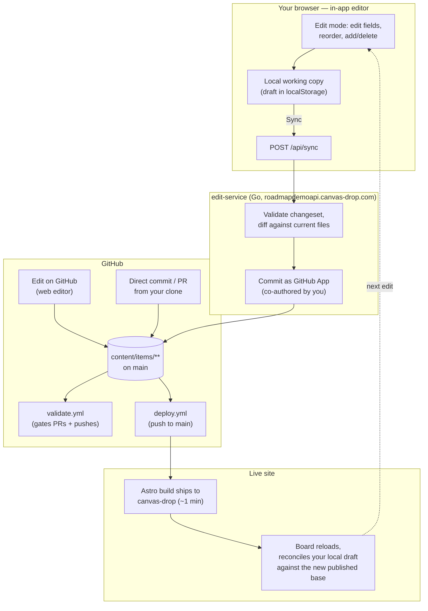
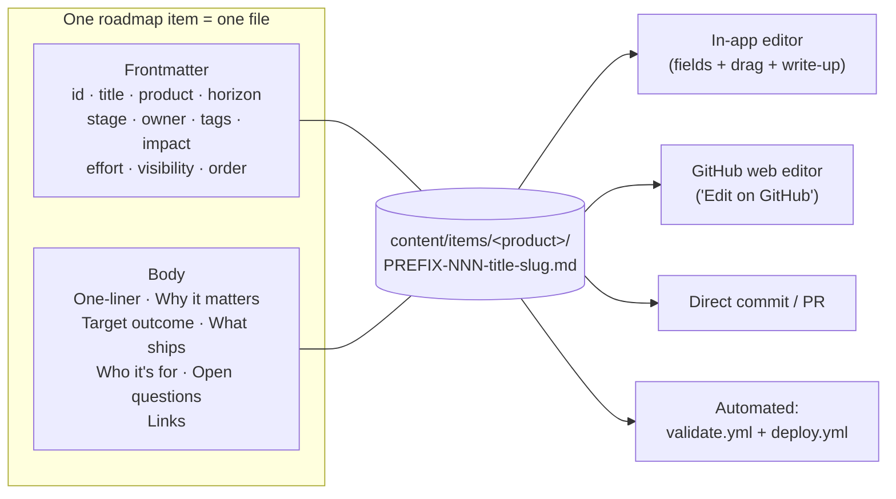

# Product Portfolio Roadmap

The single source of truth for what's **Now / Next / Later** across our products —
and the repo behind [roadmapdemo.canvas-drop.com](https://roadmapdemo.canvas-drop.com),
the live, editable view of it.

> **This is a demonstration instance.** Every roadmap item, product, owner name and
> linked document in `content/` is fictional, written to exercise the data model
> end to end. The five products (Music App, Podcasts & Audiobooks, Spotify for
> Artists, Ads Platform, Core Platform & Data) are an illustrative portfolio, not
> anyone's real plan, and this project is not affiliated with or endorsed by
> Spotify. The machinery — schema, validation, editor, sync, deploy — is real and
> is what the demo exists to show.

## What this is

- **This repo** holds every roadmap item as a markdown file under `content/items/**`,
  plus the Astro/Vue site (`site/`) and small Go service (`edit-service/`) that
  turn those files into an editable board.
- **The live site** renders those files and lets anyone with GitHub write access
  to this repo edit them in a UI — dragging cards, changing fields, writing
  the narrative — without touching git directly.
- **GitHub Actions** validate every item file and redeploy the site automatically,
  so the repo and the live site never drift apart for long.
- **AI and live collaboration** — draft a new item from a prompt, ask AI to rewrite an
  existing one, see recent changes as they land, and see who else is on the board right
  now. See [AI & collaboration](#ai--collaboration) below.

## Mental model

**The markdown files are the source of truth. The site is a live, editable view
of them.** Nothing about a roadmap item lives anywhere else — not in a database,
not in the site's build output, not in a project board. If you can see it on the
board, it's because a file under `content/items/**` says so; if you change it on
the board, that change becomes a commit to that same file.

Everything else in this README follows from that one fact.

## How to change something

Three paths, all converging on the same files:

| # | Where | Best for |
|---|---|---|
| 1 | **In-app editor** on the live site | Day-to-day edits — fields, drag-to-reorder, add/delete, the narrative write-up |
| 2 | **"Edit on GitHub"** link (opens GitHub's web editor on that file) | A quick one-off fix when you're already looking at the file |
| 3 | **A direct commit or PR** to `content/items/**` | Scripted/bulk edits, new items authored offline, anything you want reviewed first |

**1 — In-app editor (primary).** On the live site, sign in with GitHub, switch to
edit mode, and edit fields, the write-up, or drag cards to reorder/change horizon,
or add/delete items. This all happens in a **local working copy in your browser**
— nothing is written to GitHub yet. When you're done, hit **Sync**: it commits
every changed file in **one commit** to `main` (see the diagram below for exactly
how), and the site rebuilds.

**2 — Edit on GitHub.** Every item's "Edit on GitHub" link jumps straight to that
file in GitHub's web editor. Edit the frontmatter and/or body, commit — a PR for
anything you want reviewed, a direct commit to `main` for a small, confident edit.

**3 — Direct commit/PR.** Same as above but from your own clone/editor. To add a
new item this way: create `content/items/<product>/PREFIX-NNN-title-slug.md`
(next free number for that product) following the schema below, then commit.
`validate.yml` catches a bad ID, missing field, or misplaced file on the PR.

## How it reaches the live site



**The three edit paths converge on the same files** (`content/items/**` on
`main`) — an in-app Sync, a GitHub web edit, and a direct commit/PR all end up as
an ordinary push to `main`, so `validate.yml` and `deploy.yml` treat them
identically.

**Sync, concretely:** the app never talks to GitHub directly. It POSTs your
changeset to the `edit-service` (a small Go API), which re-validates it against
the *current* files, then commits using a **GitHub App** installation token — so
the commit shows up as you (co-authored) without the browser ever holding a
GitHub write token itself.

**Reconcile:** because your edits start as a local draft, the app has to
reconcile that draft against reality on every load — dropping any draft change
that the freshly-published files already reflect (so a synced edit doesn't look
"still pending" forever) while keeping anything not yet synced.

**Deploy:** any push to `main` touching `site/**` or `content/**` (except
`content/sources/**`) or `presentations/**` triggers `deploy.yml` — build takes
about a minute. You never run a deploy by hand; force one via **Actions → Deploy
roadmap site → Run workflow** if needed.

**Shares:** from the live site you can mint a public, read-only snapshot of a
filtered view — a "Share this view" — published as its own canvas-drop canvas,
independent of the team-only main site.

*(Historical note: this repo used to also sync to a GitHub Project board. That
integration is retired — ignore any references to it you find in old docs.)*

## AI & collaboration

The live site adds a few things on top of the plain editor, all built on canvas-drop's
AI/realtime Backend — see [`site/src/pages/help.astro`](site/src/pages/help.astro)
(rendered at `/help`) for the full writeup:

- **New with AI** — in edit mode, draft a full item (all sections, plus a suggested
  stage/horizon/tags) from a short prompt. It opens in the normal item editor to review;
  like any edit, nothing publishes until Sync.
- **Rewrite with AI** — a conversational panel in the item editor: it first states what
  it would change, you chat to refine, Apply shows a section-by-section before/after
  diff, and Accept writes the rewrite into your working copy (publishes on Sync).
- **Latest changes** — a "recent changes" peek on the board plus a full `/changes` page,
  built from the Sync commit history: who changed what, and a link to each commit.
- **Live presence** — "N viewing" with avatars, idling out after ~10 minutes of
  inactivity, and an advisory "X is also editing" nudge in edit mode.

**New with AI**, **Rewrite with AI**, and **presence** only appear when the canvas-drop
Backend (AI + realtime) is enabled — they're absent, not broken, when it's off. **Latest
changes** doesn't depend on that Backend; it reads GitHub's own commit history.

## Where you change what



Both frontmatter (the structured fields) and the body (the narrative) live in
the **same file** — there's no separate metadata store. All three edit paths can
touch either part; `validate.yml` only checks the frontmatter (IDs, enums,
filename/folder), so a body-only typo fix never risks a failed check.

## Item schema reference

One roadmap item = one markdown file, with a stable ID (`PREFIX-NNN`, e.g.
`MUSIC-022`, `TALK-014`, `ADS-001`) that also names the file.

| Field | Values | Meaning |
|---|---|---|
| `id` | e.g. `MUSIC-001`, `TALK-014`, `ADS-001` | Stable identifier, unique per item. Prefix also picks the product folder. |
| `title` | free text | |
| `product` | Music App · Podcasts & Audiobooks · Spotify for Artists · Ads Platform · Core Platform & Data | The product track — decides the folder + ID prefix. |
| `horizon` | Candidates · Now · Next · Later · Completed | The roadmap lane — *when / how confident*. Candidates = intake; Now/Next/Later = confidence; Completed = shipped. |
| `stage` | Discovery · Validation · Shaping · Committed · Building · Pilot · Shipped · Parked | *How real* it is. Independent of horizon — an item can be `Now` + `Shaping`. |
| `owner` | name | |

Those are required. Optional fields, add only when they earn their place:
`visibility` (Internal/Public, defaults Internal), `impact` / `effort`
(Low/Medium/High), `tags` (incl. `theme:<name>` themes), `order` (lane
priority), and `external_visibility` (Internal only/Customer-safe/Public, for
the future public view). The full, enforced schema lives in
[`site/src/lib/schema.ts`](site/src/lib/schema.ts).

The **body** holds the narrative: One-liner, Why it matters, Target outcome,
What ships, Who it's for, Open questions, `## Links`.

**Links** (`## Links` section, one per line as `- Label: target`):

- **External** — a full `https://` URL (Notion, Figma, a doc) → renders as a
  chip that opens in a new tab. Most links are this.
  ```markdown
  - Notion card: https://www.notion.so/example/Onboarding-38785…
  - Design: https://www.figma.com/board/AbC123/Discovery
  ```
- **Internal doc** — a path under `content/prds/`, `content/technical-design/`,
  or `content/research/` (relative to `content/`, `.md`) → renders as a page in
  the site's `/docs` library.
  ```markdown
  - PRD: prds/TALK-014-onboarding.md
  ```
- **Presentation** — a published path under `presentations/`.
  ```markdown
  - Proposal deck: /p/music-app-global-templates-deck/
  ```

Rule of thumb: **a URL opens out; a repo path stays in the site.** Empty lines
(`- PRD:`) are ignored, so a template can list every type and you fill in only
what you have.

## Supporting documents & assets (PRDs, tech designs, research, presentations)

The repo isn't just the roadmap — it also hosts the **documents and assets behind
the work**, published as pages on the site so a link stays inside the product
instead of scattering across Notion/Drive.

**Three document libraries**, each a folder of markdown files, published under `/docs`:

| Folder | Type | Published at |
| --- | --- | --- |
| `content/prds/` | **PRD** | `/docs/prd/<slug>` |
| `content/technical-design/` | **Technical design** | `/docs/technical-design/<slug>` |
| `content/research/` | **Research** | `/docs/research/<slug>` |

Plus **presentations / microsites** — self-contained hosted decks under `/p/<slug>/`
(built and deployed with the site) that an item can link to.

**Adding a document.** Create a markdown file in the relevant folder (via the GitHub
web editor or a commit — the in-app editor edits roadmap *items*, documents are added
in the repo). Frontmatter:

```markdown
---
title: Onboarding revamp — PRD
roadmap_item: TALK-014        # the item ID this doc belongs to (back-links it)
owner: Jules
status: Draft
visibility: Internal        # or Public — see below
updated: 2026-07-06
---

# Onboarding revamp — PRD
…the document body (markdown)…
```

**How a document connects to a roadmap item — two directions, use either or both:**

1. **From the document** — set `roadmap_item: <ITEM-ID>` in its frontmatter. The site
   associates the doc with that item automatically (it also feeds the item's search).
2. **From the item** — add a line to the item's `## Links` section pointing at the
   file, e.g. `- PRD: prds/TALK-014-onboarding.md` (see [Links](#item-schema-reference)
   above). This renders as an in-site doc chip on the card/drawer.

**Public vs internal.** Documents and presentations carry the same `visibility` field
as items (`Internal` by default, or `Public`). On a public build — and in the public
**shares** you mint from a view — only `Public` docs/assets appear, so you can share a
PRD or a deck publicly alongside the roadmap while everything else stays internal.

## Repo layout

```
content/
  items/            the roadmap items (one file per item, grouped by product) — the source of truth
  prds/             product requirement docs        ┐ internal docs, rendered on the site's
  technical-design/ technical designs               │ /docs library (currently WIP / empty —
  research/         research notes / evidence        ┘ fill in as we author them in-repo)
  sources/          raw input roadmaps — historical input only, NOT rendered
presentations/      self-contained microsites, published at /p/<slug>/
site/               the Astro + Vue site: renders content/, plus the in-app editor UI
edit-service/       the Go API behind the in-app editor (auth, changeset validation, GitHub App commit)
tooling/            Python validation (validate_items.py)
docs/plans/         this system's own design/plan docs
```

External resources (Notion, Figma, Google, a deck) don't need the docs library —
add them to an item's `## Links` and they render on the card and open in a new tab.

## Automation

| Workflow | Trigger | What it does |
|---|---|---|
| `validate.yml` | PR or push touching `content/items/**` | Runs `tooling/validate_items.py`: checks every item's ID (format & uniqueness), required fields, and filename/folder. **Gates PRs** — a bad item blocks merge. Also runs after a direct push, so a problem there is flagged (not prevented). |
| `deploy.yml` | Push to `main` touching `site/**`, `content/**` (excl. `sources/`), or `presentations/**` + manual dispatch | Builds the site, bundles `presentations/`, deploys to canvas-drop (`roadmapdemo.canvas-drop.com`). Covers both an in-app Sync and a direct commit/merged PR — both are just a push to `main`. |

**PR vs. direct commit, in practice:** both trigger the same validation and
deploy. The difference is *when* validation gates: on a **PR**, a bad item
**blocks the merge** before it reaches `main`. On a **direct commit** (including
an in-app **Sync**, which commits directly), validation still runs but *after*
the commit has landed — it flags the problem rather than preventing it, so you
fix forward. Use a PR when you want that pre-merge safety net or a review trail;
use direct commits/Sync for small, confident edits.

## FAQ

**Where do I change an item's status, owner, or tags?**
In the app (edit mode), or the file's frontmatter on GitHub — same file, three
doors in.

**Where do I change the write-up (why it matters, what ships)?**
Same two options — the app's edit mode, or the markdown body on GitHub.

**How do I add a new item?**
**Add** in the app's edit mode (then Sync), or create the file directly on
GitHub under `content/items/<product>/` following the schema above.

**How do I delete an item?**
Delete it in the app's edit mode (then Sync), or delete its file via a
commit/PR to `main`.

**Can I commit directly to `main`, or do I need a PR?**
Both work and both trigger the same automation. See [Automation](#automation)
above for the gating difference.

**I got a duplicate-ID error on my PR.**
Two items share an `id`. Pick the next free number for that product/prefix and
rename both the `id` field and the filename.

**The site asks me to log in.**
It's team-only. Sign in with GitHub to view; you also need GitHub write access
to this repo to use edit mode (that's what `edit-service` checks before it
issues you a session).

**What's the difference between `horizon` and `stage`?**
`horizon` is the roadmap lane (when/how confident: Now/Next/Later). `stage` is
how real the work is (Discovery → … → Shipped). They're independent — track
which lane an item's *in*, stage tracks how *cooked* it is.

**What happened to the GitHub Project board?**
It's retired — this repo previously synced items to a GitHub Project board;
that integration and its `PROJECT_SYNC_TOKEN` secret are gone. Ignore any
references to it in older docs.

## Weekly hygiene

Once a week, scan for: items with no owner, `Now` items still in early stages,
`Shipped`/`Completed` items without release notes, and stale `Later` items to
park or delete. This matters more than adding new fields.

## Quick links

- **Site:** https://roadmapdemo.canvas-drop.com
