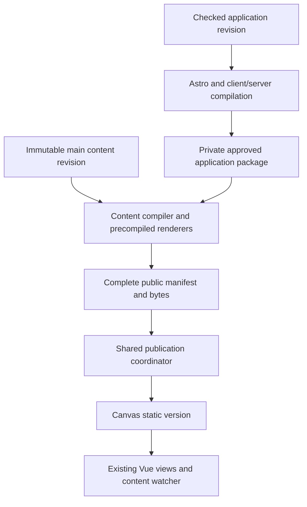

# Content Publication Without Application Rebuilds - Plan

Target repository: `seenthis-ab/product-roadmap` only.
Planning baseline: `324bf163791524de91e5e0863f6807e6a5aa4912`, which includes the previously local instrumentation, history cache, visible-strip removal, concurrency/document-lookup improvements, and both subsequent UI publications.
The implementation must preserve publications that arrive after this baseline.

## Goal Capsule

- **Objective:** Editors and viewers see published roadmap changes promptly, and open tabs show content updates without requiring a browser refresh.
- **Means:** Separate application compilation from content publication, retaining Git and the server fast path (KTD1–KTD6).
- **Authority:** The Product Contract owns behavior; the Planning Contract owns implementation choices within it. This document authorizes no production action by itself.
- **Execution:** Characterize existing behavior, prove the reusable renderer, migrate behind a gate, verify both publishers and live browser updates, then release product-roadmap.
- **Ownership:** The implementing operator owns code, tests, rollout evidence and cleanup. Mark supplies the agreed live UI/outside-UI edits and assists with the race test.
- **Stop conditions:** Content/permission regressions, untrusted application artifacts, failed required checks, lost drafts, or failed release verification stop activation. A failed performance gate prevents declaring this optimization complete.
- **Finish:** Product-roadmap is verified and its landing state is clean; a separate generalized port remains deferred under R12.

---

## Product Contract

### Summary

Publish roadmap content independently of the Astro application build while retaining the current interface, direct links, Git editing and Canvas Drop hosting.
Open tabs receive complete content updates in place.
Verify product-roadmap first, including UI publication, outside-editor publication, concurrent changes, fallback and rollback.

### Problem Frame

An owner, horizon or wording edit currently recompiles the application and regenerates the site through Astro.
The last recorded server sample took 33.5 seconds end to end, including 22.9 seconds in Astro, before browser observation delay.
Those are historical measurements from the preceding live test, not a new benchmark or a promised future latency.
The warm history cache already removes most history-processing cost; further full-build tuning cannot remove the coupling between content changes and application compilation.

### Requirements

**Publishing and source of truth**

- R1. Git Markdown remains authoritative. A publication uses one immutable, validated revision of main, whether the change originated in the UI, a PR, a Git client or an agent.
- R2. Eligible content changes update the published site without running Astro, Vite bundling, dependency installation or an application compiler on the ordinary warm path.
- R3. Application changes retain a fully checked application build and deployment path. Mixed changes cannot reuse an incompatible application package.
- R4. Keep the server fast path and GitHub Actions fallback. Missing credentials, unavailable approved artifacts or disabled local publication cannot lose a committed change or prevent Actions from publishing it.
- R5. Publishers targeting the same application/content/profile release suppress duplicate activation. An attempt that observes a newer source revision or intervening Canvas publication must stop; it cannot refresh its token and blindly retry stale output.

**Viewer and editor experience**

- R6. Board, product views, full item pages, document pages/index, themes, item history, activity-derived item metadata, resource catalog and search must describe the same published revision. New/deleted routes and resource visibility changes take effect with that revision.
- R7. Compatible content updates apply automatically in open tabs without navigation or reload. Preserve filter/view settings, selection, scroll and keyboard focus wherever the target still exists; explain removal when it does not.
- R8. Never discard or silently overwrite unsaved edits, pending publication receipts or committed-but-not-yet-live work when published content refreshes. Existing conflict resolution remains authoritative.
- R9. An application-code change may offer a normal reload after protecting drafts. No supported update path requires a cache-clearing hard refresh. Failed/offline content refresh retains the last complete view with truthful status.

**Safety and verification**

- R10. Preserve Canvas viewer access controls and GitHub editor authorization. Public output must exclude internal items, sections, owners, documents, search terms and resource bytes before they reach a browser. No deploy keys, draft state or private build artifacts may enter published files.
- R11. Report saved-to-Git, preparing, live, superseded and failed states accurately. Live proof requires authenticated release/manifest verification and browser confirmation; Actions success alone is not proof of visible content.
- R12. Implement and verify only product-roadmap. Do not modify, deploy or test through product-roadmap-generalized or change Canvas Drop to complete this migration.
- R13. Managed uploads are content, not application changes. A publish activates the committed item/document references and their validated asset bytes together, including supported images, video, PDFs and other attachments. Unpublished uploads remain private draft resources; failed preparation/publication must preserve them for retry.

### Success Criteria

- The qualifying warm content path invokes no application compiler, and unchanged application asset hashes are identical across publications.
- Release gate: at least 50% lower median source-commit-to-verified-activation latency than paired current-flow runs on the same server/resource limits, using at least ten comparable samples per path. A median below ten seconds is a stretch target, not a pre-measured claim.
- In a foreground, connected tab, compatible content becomes visible within five seconds of activation under the controlled acceptance network, with zero document reloads. Measure publishing-editor and ordinary-viewer tabs separately.
- First-load content, direct links, Markdown presentation, keyboard use and drafts pass the parity tests. Publication speed cannot be purchased through correctness or access-control regressions.
- Cold cache, outside-editor detection, burst/coalesced publication, fallback and application-release timing are reported separately from the warm content result. With ten samples report median, range and maximum, not an asserted production p95.

### Scope Boundaries

The migration changes content preparation, rendering integration, browser updates, local publication and Actions coordination, plus the same-release additions below.
It does not add a database/CMS, collaborative text editing, request-time rendering infrastructure, new Canvas capabilities or a broad visual redesign.
Existing baked shares remain intentional snapshots; updating the live roadmap must not silently rewrite them.
Presentations and non-managed static files remain application-package inputs for this first release, so changes there use the full path.

#### Deferred to Follow-Up Work

Port the verified implementation to product-roadmap-generalized in a separately approved change, preserving demo content, branding, access mode, secrets and repository policy.
Automatic server installation of newly built executable application packages is deferred; explicit trusted-package promotion remains an operational boundary under KTD3.
Fine-grained page caching, delta-only browser protocols and realtime push notifications are optional later optimizations, not prerequisites.

### Acceptance Examples

- AE1. Covers R1, R2, R7, R11. Mark changes an item's horizon and publishes. A separate viewer tab moves the item without reload, and evidence identifies the local content publisher and exact live revision.
- AE2. Covers R1, R4, R5. Mark merges an outside-editor wording change. The webhook wakes the same content worker; with that worker disabled, Actions publishes the change instead. Neither case requires an editor browser to be open.
- AE3. Covers R5, R8. Publication A pauses before activation; compatible publication B reaches main. A is discarded and the final live snapshot includes both edits, while unrelated local drafts remain intact.
- AE4. Covers R6, R10. A new item and linked document become reachable directly. A later deletion/visibility reduction removes them from routes, search and resource manifests without a stale copied page surviving.
- AE5. Covers R7–R9. Another person updates an item while a viewer is filtered/scrolled and an editor has a dirty form. The viewer updates in place; the editor's form remains intact and conflicting remote changes enter the existing resolution flow.
- AE6. Covers R3, R9. A new application release arrives in an old tab. The tab does not hydrate an incompatible snapshot, retains its current content/drafts and offers a normal reload.
- AE7. Covers R4, R11. Local publication fails or its finalize response is lost. Status is recovered by readback or Actions fallback; no second commit and no false live confirmation is created.
- AE8. Covers R7, R10, R13. Mark uploads an image and attachment, references them in an item and publishes. Another open tab shows the new cover/links without refreshing; the files load from Canvas, not an editor session. Replacing the cover uses its new revision URL, and a failed upload/publish preserves the draft and the prior live version.

---

## Planning Contract

### Current Architecture and Research

| Existing area | Evidence | Consequence for this migration |
|---|---|---|
| Astro entry points | `site/src/pages/index.astro`, `[product].astro`, `changes.astro` call `buildBoardItems` | Root and secondary views must lose their build-time content dependency together |
| Model construction | `site/src/lib/board.ts`, `docs.ts`, `schema.ts`, `itemHistory.server.ts` | Extract shared transformations; retain backing-document titles/search and Git-derived dates |
| Editor refresh | `site/src/components/board/Board.vue`, `site/src/lib/edit/liveItems.ts` | Reactive replacement exists, but the editor mapper explicitly omits document-title/backing-document enrichment; it is not the published-data contract |
| Static content pages | `site/src/pages/item/[id].astro`, `docs/[type]/[slug].astro`, `themes.astro`, `changelog.astro` | Current routes and initial HTML must be supplied without a new Astro compilation |
| Markdown and resources | `astro.config.mjs`, `MarkdownContent.astro`, `richMarkdown.ts`, `site/scripts/managed-assets.mjs` | Two rendering policies exist; preserve their characterized semantics and extract resource validation/copying from build hooks |
| Worker | `edit-service/localbuild.go`, `publication.go`, `server.go` | One coalescing wake slot, immutable checkout and final freshness guard already exist; startup has no webhook route |
| Deployment | `tooling/deploy/coordinate.mjs`, `.github/workflows/deploy.yml` | Shared coordinator currently uploads ZIPs; extend it rather than create separate Go and Actions protocols |
| CI classification | `tooling/ci/changes.mjs`, `.github/workflows/checks.yml` | The last successful deployment is deliberately used so a cancelled code release cannot be bypassed by a later content push |
| Publication status | `site/src/lib/edit/version.ts`, `edit-service/server.go` | Current client compares one build commit and polls every 15 seconds; distinguish application from content identity |
| Prior optimizations | `docs/build-performance.md`, `docs/solutions/2026-09-12-committed-image-object-reads.md` | Retain history cache, bounded immutable reads, instrumentation and static-first published resources |

No root strategy/concepts document or configured Compound Packs were found at this baseline.
The prior coordinated-publishing release plan, `docs/plans/2026-09-12-2129-feat-coordinated-publishing-release-plan.md`, supplies regression scenarios, not a mandate to touch both repositories in this change.

### Key Technical Decisions

- KTD1. **Keep Astro/Vue, Go and Git; separate compilation from publication.** (session-settled: user-approved — chosen over a framework/database rewrite: remove content-triggered compilation while preserving the existing system.) Governs R1–R4. Astro produces the application package on code changes; a standalone content command prepares published data and HTML from an immutable content revision.
- KTD2. **Use one deterministic content model and precompiled page renderers.** Governs R2, R6, R10. Extract transformation/schema/Markdown/resource logic into modules independent of `astro:content` and build-time environment globals. Move content-dependent page bodies to shared Vue presentation components, compiled once for client use and Node rendering. Use Vue's existing `vue/server-renderer` export; the Node renderer runs only during publication, never per viewer request. Astro produces the surrounding code-only layout templates and assets. This retains initial HTML, metadata and ordinary direct routes while avoiding compilation on content edits. It is more work than client-only empty shells, but avoids a first-load/accessibility regression. The U2 proof gate must validate the integration before broad page conversion. See [Vue SSR and hydration](https://vuejs.org/guide/scaling-up/ssr.html).
- KTD3. **Reuse a trusted, immutable application package.** Governs R3, R4, R10. The package contains compiled client assets, layout templates, private renderer/compiler code and a complete inventory with hashes. A successful exact-main application CI run emits the canonical package as a private artifact. Local installation explicitly promotes that verified package and approved baseline; arbitrary checked-out code or a Canvas document must never authorize execution. Stage/install to a new owned directory, validate hashes and protocol/profile, then atomically change the approved pointer. Preserve the previous package for rollback. Keep publisher subprocess credentials stripped as in `localbuild.go`. Missing, corrupt, expired or mismatched packages disable local reuse and leave Actions' full-build fallback available; there is no dependency installation in a content job. Directly used YAML parsing must be declared/pinned from the existing locked tooling rather than relying on an accidental transitive import. No new rendering framework is required.
- KTD4. **Separate source, application and content identity.** Governs R3, R5, R9, R11. The release descriptor carries target source commit, application source commit/package digest, build profile, content schema version and snapshot digest. A shared versioned release identity includes repo, target commit, profile and canonical application-package identity. Content reuse selects the package identified by the authenticated current release, independently verified against trusted CI provenance; the descriptor is not execution authority. Both publishers bind that same identity before preflight. A locally approved package that differs cannot replace the live application: stop local reuse and rely on Actions. Only a checked application/full-fallback release may select a replacement package, including initial migration from a legacy descriptor. Reconciliation must not undo that replacement while awaiting server promotion. Keep `version.json.commit` equal to the target source commit for existing status consumers; add fields rather than change that meaning. The browser compares application identity separately from content identity. Remove content commit/wall-clock stamps from reusable application bundles; publication timestamps belong to the content descriptor. Classify against the approved application's source tree using the conservative content allowlist, including file modes, not merely against the last push. No-op/receipt-only commits may advance provenance without changing semantic content.
- KTD5. **Publish one complete Canvas version through staged upload.** (session-settled: user-approved — chosen over a new Canvas content API: existing file reuse and conditional activation already fit.) Governs R4–R6, R10. Compose the application-owned manifest plus the freshly generated content-owned manifest, never patch an unspecified live directory. Content-owned paths include current HTML, snapshots, resources, catalog and sitemap; removed paths are omitted. Upload only missing hashes. Keep Canvas access controls by serving all viewer data from the same canvas origin; editor APIs remain editor-only. Follow the [staged upload and coordination contract](https://canvas-drop.com/docs/api/deploy-api), not ZIP field assumptions. Application/compiler private files cannot enter the public manifest.
- KTD6. **One coordinator for both publishers, with conservative conflict recovery.** Governs R4, R5, R11. Extend `tooling/deploy/coordinate.mjs` for staged begin/upload/finalize. Check source freshness before preparation and immediately before finalize, bind the captured publication token, then verify the activated identity and complete manifest. Never adopt a replacement token after a conflict without a new attempt and fresh preparation. Lost responses trigger readback; `already_current` must be verified, not trusted from a local receipt. Bound upload concurrency, honor `Retry-After`, and handle the documented 15-minute upload expiry. A cached approved application manifest can supply hashes, but a missing blob must be retrieved from the verified package or cause safe fallback, never fabricated or omitted. Git and Canvas cannot be updated in one transaction: a Git push after the final freshness read can still briefly race activation; a post-activation source check and reconciliation must converge to newest main without claiming linearizability across the services.
- KTD7. **Atomic content replacement in browsers.** Governs R6–R9. Publish a compact same-origin release descriptor and content-addressed snapshot files. The client validates schema, profile, application compatibility and content hash, loads a complete candidate, and swaps the reactive published model only after validation. Never mix independently fetched items/documents from different revisions. Hydrate from the matching initial page seed before applying newer content. Poll the descriptor every three seconds while visible, once on focus/online, with bounded timeout/backoff and one in-flight request. Use revalidation/no-store for the descriptor; content-addressed URLs prevent stale bytes being mistaken for new content. A slow response cannot overwrite a later accepted revision. Pause view replacement during a drag, IME composition or active dirty editor conflict; retain the candidate for reconciliation. Keep published state separate from edit-store working bases and pending commits. No new WebSocket or Canvas runtime capability is required. See [Astro client-side fetching](https://docs.astro.build/en/guides/data-fetching/).
- KTD8. **Outside-editor notifications are hints, not source authority.** Governs R1, R4, R5. Add a repository-scoped signed GitHub push webhook to the Go service and a bounded 60-second main reconciliation timer, including a startup reconciliation. Verify the raw-body HMAC, repository identity and main ref, acknowledge promptly after enqueue, and coalesce duplicate/out-of-order delivery hints. Fetch authoritative main rather than execute a payload-supplied SHA or command. A separate webhook secret is configured server-side; its absence leaves the timer and Actions fallback working. Failed delivery is covered by reconciliation rather than a browser being open. See [GitHub webhook validation](https://docs.github.com/en/webhooks/using-webhooks/validating-webhook-deliveries) and [delivery practices](https://docs.github.com/en/webhooks/using-webhooks/best-practices-for-using-webhooks).
- KTD9. **Preserve validation and make byte ownership explicit.** Governs R2, R6, R10. Produce a full small roadmap snapshot initially, not fine-grained dependency caching. Preserve Zod validation, item validation, document-link checks, Git-derived item dates, Markdown heading/anchor behavior and managed-resource checks. Filter audience before enrichment/rendering/serialization, including catalogs and referenced originals. Reject route collisions, duplicate identifiers, path traversal, symlinks and unsafe serialized HTML. Markdown is data, never an executable Vue/Astro template. Application extraction/build occurs without publishing credentials; only the reviewed coordinator receives tokens.

### High-Level Technical Design

#### Components and ownership



#### Publication protocol

```mermaid
sequenceDiagram
  participant Trigger as UI / webhook / timer / Actions
  participant Worker as Publisher
  participant Git as GitHub main
  participant Canvas as Canvas Drop
  Trigger->>Worker: Wake or run publication
  Worker->>Git: Resolve authoritative head H
  Worker->>Canvas: Read current identity and token
  Worker->>Worker: Resolve approved package; validate and prepare H
  Worker->>Canvas: Begin complete manifest with release identity/token
  Canvas-->>Worker: Missing hashes or already current
  Worker->>Canvas: Upload missing blobs
  Worker->>Git: Recheck head H
  Worker->>Canvas: Conditional finalize
  Worker->>Canvas: Verify identity, manifest and descriptor bytes
  Worker->>Git: Recheck source and schedule reconciliation if changed
```

#### Browser state transitions

```mermaid
stateDiagram-v2
  [*] --> ShowingSeed
  ShowingSeed --> Checking
  Checking --> LoadingCandidate: compatible content changed
  LoadingCandidate --> Applying: complete and validated
  LoadingCandidate --> ShowingSeed: offline or invalid; retain view
  Applying --> Checking: atomic swap; preserve interaction state
  Checking --> ReloadAvailable: application changed
  ReloadAvailable --> ShowingSeed: user reloads after draft protection
  Applying --> PendingReconcile: dirty or active interaction
  PendingReconcile --> Applying: interaction ends or conflict resolved
```



#### Mode and eligibility decisions

| Condition | Server behavior | Actions behavior |
|---|---|---|
| Feature disabled or missing local deploy token | Existing save only; no local activation | Existing full publication path |
| Matching approved package and content-only diff | Prepare and stage content | Reuse canonical package, or verify already current |
| Application/profile/protocol changed | No reuse until explicit package promotion | Full checked application build and composed publication |
| Package missing/corrupt | Stop local attempt; report fallback | Recover verified package or full build |
| Newer Git head or Canvas token conflict | Discard attempt; reconcile latest | Stop stale run; newest eligible run owns publication |
| Rollback/unpublish while attempt is active | Token invalidates that attempt | No stale retry with a refreshed token |

#### Artifact lifecycle

Each attempt owns a temporary checkout and output directory and releases both on success, failure or cancellation.
Each approved application package remains immutable; keep current and previous packages plus packages leased by active attempts.
Snapshot names are content-addressed, but the current Canvas manifest owns availability: a prior snapshot can disappear after activation/pruning.
On a missing snapshot, the browser refetches the descriptor and retries once for the current revision rather than loop on an old URL.
Freshly loaded pages contain a usable matching seed; already-open tabs retain their validated data in memory through transient failures.
Do not promise revocation of bytes already delivered to a browser; access/visibility changes prevent future unauthorized delivery.

### Route and Content Coverage

| Surface | Planned treatment | Specific parity checks |
|---|---|---|
| `/`, product boards, `/changes` | Shared model and reactive Vue roots with matching initial seed | Filters, URLs/session preferences, Git history, activity item titles |
| `/item/:id` | Precompiled item presentation plus current HTML/seed | Full sections, planned dates, previous/next, owner/stage, cover, edit links |
| `/docs`, `/docs/:type/:slug` | Shared document model and precompiled presentation | Headings, TOC, code, Mermaid, raw-HTML policy, backlinks and direct links |
| `/themes`, `/changelog` | Same revision's derived groups/history | Ordering, timestamps, visibility and navigation |
| `resources.json`, managed originals | Regenerate catalog and referenced byte inventory | Hashes, MIME, missing links, public/internal enforcement |
| Sitemap and generated metadata | Generate from current permitted routes | New/deleted routes, canonical/base URLs, no stale private entries |
| Help, shares UI, presentations, branding | Retain application package ownership | Stable assets and backend configuration; baked shares unchanged |

### Execution-Time Proofs and Limits

The compiled-renderer speed, hydration behavior and package-size impact are not measured yet; U2 owns that proof before U3 conversion proceeds.
Validate the available Markdown processor API during implementation and declare any directly used package from the existing dependency set explicitly.
Do not replace full document rendering with the editor preview parser solely because both accept Markdown.
The initial three-second poll is a controlled target; measure request load and background-tab behavior without adding a realtime dependency.
Keep the approved 1000 MiB service memory limit and existing CPU/swap limits for comparative runs; no resource-limit increase is part of this plan.

---

## Implementation Units

### U1. Extract and characterize the published content model

- **Goal:** One framework-independent model supplies every published surface.
- **Requirements:** R1, R6, R10, R13; KTD1, KTD2, KTD9.
- **Dependencies:** None.
- **Files:** Modify `site/src/lib/board.ts`, `docs.ts`, `schema.ts`, `itemHistory.server.ts`, `site/src/content.config.ts`; create `site/src/lib/published/model.ts`, `schema.ts`, `model.test.ts`, and `site/scripts/prepare-content.mjs`; extend `site/src/lib/edit/liveItems.test.ts` and `site/scripts/build-item-history.test.mjs`.
- **Approach:** Separate source loading from normalization/enrichment; inject audience, base URL and Git metadata. Make the existing Astro adapter consume the shared model first, without changing production delivery. Keep editor working-copy mapping separate where its data is intentionally incomplete.
- **Patterns:** `buildBoardItems`, `getVisibleDocCollections`, `normalizeItemHistory`, `assetCatalog`.
- **Execution note:** Characterize current output before replacing loaders, including fixtures that actually contain public and internal content.
- **Test scenarios:**
  1. Equivalent Markdown yields matching board fields, document titles, backing-document search, ordering and dates through old/new adapters.
  2. Quoted/multiline YAML, optional collections, missing titles, duplicate IDs and colliding document basenames produce the defined result or validation failure.
  3. Public fixtures remove internal owner/section/document/resource/search sentinels before serialization.
  4. Renames, reverts, merges and cold/corrupt history caches preserve Git-derived dates.
  5. A source symlink or malformed resource manifest fails without reading outside the checkout.
- **Verification:** Existing behavior is characterized and the shared model is demonstrably complete; no publish-path switch yet.

### U2. Produce and prove reusable application packages

- **Goal:** Application compilation yields a reusable renderer and stable asset package.
- **Requirements:** R2, R3, R6, R10; KTD2–KTD4.
- **Dependencies:** U1.
- **Files:** Modify `site/astro.config.mjs`, `site/package.json`, `site/package-lock.json`, `site/src/layouts/Base.astro`; create `site/scripts/build-application.mjs`, `site/src/published-renderer.ts`, `site/src/published-client.ts`, `site/src/lib/published/application.ts`, `application.test.ts`, and `site/scripts/application-package.test.mjs`.
- **Approach:** Compile a narrow board/item/document proof using the existing Vue/Vite stack. Export explicit layout insertion points, escaped page metadata and matching server/client entry points; do not patch Astro's undocumented serialized island props. Keep private renderer files outside public output. Emit an inventory binding source/profile/protocol and package bytes.
- **Patterns:** Existing Vue integration, `Base.astro`, `site/src/components/ui/hydration.test.ts`, credential-free build environment.
- **Test scenarios:**
  1. One package renders two different content revisions with zero Astro/Vite/compiler invocations on the second render.
  2. A browser hydrates the generated page without mismatch, duplicate mounts or lost event handlers.
  3. Code/profile changes invalidate reuse; content/receipt-only commits do not alter application asset hashes.
  4. Raw HTML, script terminators and metadata quotes cannot break out of escaped serialization or become executable templates.
  5. Server-side component state cannot leak between routes or public/internal render contexts.
  6. Package traversal, wrong digest and mismatched dependency/runtime versions are rejected.
- **Verification:** The proof preserves initial HTML and interaction behavior, and measured preparation shows a credible path to the Success Criteria. If it cannot, stop before broad conversion and revise the technical approach rather than ship an empty-shell regression.

### U3. Migrate all content pages and output ownership

- **Goal:** Content publication produces complete current HTML, snapshots and resources without rebuilding the app.
- **Requirements:** R2, R6, R10, R13; KTD2, KTD5, KTD9. Asset coverage includes outside-editor Git changes under AE8.
- **Dependencies:** U1, U2.
- **Files:** Modify all content-dependent routes in Route and Content Coverage, `site/src/components/markdown/MarkdownContent.astro`, `site/scripts/managed-assets.mjs`, `site/scripts/check-document-links.mjs`, `site/scripts/check-item-history.mjs`; create `site/src/components/published/ItemPage.vue`, `DocumentPage.vue`, `DocumentsIndex.vue`, `ThemesPage.vue`, `ChangelogPage.vue`, `pages.test.ts`; create `site/scripts/content-output.test.mjs` and `site/src/lib/published/manifest.ts`.
- **Approach:** Move page bodies to shared renderable components, retaining styling and semantic markup. Extract existing Markdown transforms and managed-resource checks. Generate content-owned routes/catalog/sitemap from the full current model, then compose with application-owned files. An empty snapshot is a valid publication, not an excuse to copy old pages.
- **Patterns:** Existing item/doc layouts, Markdown TOC/Mermaid behavior, `resourceHref`, `confinedFile` and current link/date checks.
- **Test scenarios:**
  1. Covers AE4. Create, rename, delete and change visibility for items/docs/assets; direct routes and complete manifest reflect only current permitted output.
  2. New documents render tables, task lists, code highlighting, Mermaid, anchors, images and backlinks as before.
  3. Root and non-root base paths preserve every navigation/resource URL and sitemap entry.
  4. Empty collections and all-items-deleted output contain no stale item, search or catalog data.
  5. Missing/internal resources, hash corruption, duplicate output paths or excessive output sizes reject the candidate before upload.
  6. Existing presentations and non-content static files survive composition byte-for-byte.
  7. Covers AE8. Newly committed image, video, PDF and non-previewable attachment bytes and references ship together; unused draft uploads never enter the manifest.
  8. A replacement cover uses a new immutable URL; deleted/unreferenced or newly internal resources do not survive by being inherited from the previous manifest.
- **Verification:** Full route/HTML/model parity and resource checks pass for both audience fixtures within product-roadmap.

### U4. Apply published content in place and preserve editing state

- **Goal:** All open content views update without refresh; application updates remain distinct.
- **Requirements:** R7–R11, R13; KTD4, KTD7.
- **Dependencies:** U1–U3.
- **Files:** Modify `site/src/components/board/Board.vue`, `RecentChanges.vue`, `site/src/lib/edit/version.ts`, `version.test.ts`, `statusCopy.ts`, `statusCopy.test.ts`, `site/src/lib/edit/store.test.ts`, `Board.authoring.test.ts`, `Board.test.ts`; create `site/src/lib/published/client.ts`, `client.test.ts`, `usePublishedContent.ts`, `site/src/components/published/live-update.test.ts`; extend `edit-service/status_test.go` only if additive status changes are needed.
- **Approach:** Maintain separate published and editing-base revisions. Feed all content roots from the shared watcher; hydrate before refreshing. Use the existing reconcile/conflict paths with interaction guards rather than replacing edit-store state. Preserve query/session precedence, focus and stable-ID scroll anchors. Re-render diagrams only when their content changes and release obsolete handlers/object URLs.
- **Patterns:** `liveItems`, `projectBoard`, edit-store reconciliation, current publication receipt recovery and `fetchDeployedCommit`.
- **Test scenarios:**
  1. Covers AE1, AE5. Two tabs show a new revision with no reload while filters, open drawer, focus and scroll remain stable.
  2. Covers AE5. Dirty edits, pending commits, active drag and IME composition survive a remote update; overlapping changes remain conflicts.
  3. A deleted open item displays an unavailable state without discarding a draft for that item.
  4. Slow/out-of-order fetches, malformed JSON, wrong hash/profile and incompatible schema cannot replace the last valid model.
  5. Hidden/offline tabs stop routine polling; focus/online triggers bounded refresh without accumulating timers.
  6. Covers AE6. New application identity offers a normal reload; content-only identity never raises that prompt.
  7. Covers AE7. Saved-to-Git remains distinct from live when Actions/local preparation fails or another compatible commit includes the publication.
  8. Baked shares remain unchanged, and creating a new share uses an internally consistent selected revision.
  9. Covers AE8. An open cover/document/media preview updates to the new asset revision without reload; pending upload object URLs remain valid until safe replacement and are then released.
- **Verification:** Browser navigation/reload counters stay unchanged for content updates; explicit automated draft-preservation assertions pass.

### U5. Add staged publication to the shared coordinator

- **Goal:** Both publishers upload only missing bytes and verify the same composed release.
- **Requirements:** R4, R5, R10, R11, R13; KTD4–KTD6.
- **Dependencies:** U2, U3.
- **Files:** Modify `tooling/deploy/coordinate.mjs`, `tooling/ci/coordination.test.mjs`, `site/scripts/verify-deploy.mjs`; create `tooling/deploy/staged.mjs`, `tooling/ci/staged-publication.test.mjs`.
- **Approach:** Extend the existing preflight/publish/verify contract with complete manifests and canonical package provenance. Bind the same release identity across local and CI implementations. Verify expected full file membership/hash/size, descriptor and selected served bytes, with stable publication identity before and after readback. Distinguish complete-manifest proof from local-byte and already-current identity proof.
- **Patterns:** Existing `assertLatest`, `writePrivateJSON`, readback-after-lost-response and exact-SHA tests.
- **Test scenarios:**
  1. Same content/application release from two publishers activates once; the loser verifies `already_current`.
  2. Unchanged hashes are not uploaded; a cold missing application blob is supplied only from the verified package.
  3. Canvas publication changes at begin, during upload or before finalize produce a conflict without stale activation.
  4. Source changes before finalize discard the candidate; source changes after the last read trigger reconciliation without a false final-current claim.
  5. Lost finalize replies, expiry, partial blobs, 429 with retry delay and malformed responses recover safely or fail explicitly.
  6. Manifest extra/missing files, wrong source/app identity or a publication change during verification prevent success.
- **Verification:** Contract tests cover the real staged response shapes and all coordination failure boundaries; no production deployment is needed for this unit.

### U6. Wire the server content worker and outside-editor detection

- **Goal:** The Go service prepares content quickly for every source while retaining save correctness.
- **Requirements:** R1–R5, R8, R10, R11, R13; KTD3, KTD6, KTD8.
- **Asset regression files:** Include `edit-service/assets.go`, `authoring_test.go`, `asset_content_test.go` and `publication.go`, modifying them only where integration requires it.
- **Dependencies:** U1, U2, U3, U5.
- **Files:** Modify `edit-service/localbuild.go`, `localbuild_test.go`, `localbuild_timing.go`, `localbuild_timing_test.go`, `config.go`, `config_test.go`, `server.go`, `main.go`, `.env.example`; create `edit-service/webhook.go`, `webhook_test.go`, `reconcile_test.go`, `application_package_test.go`; retain publication/conflict/idempotency tests.
- **Approach:** Reuse the single coalescing worker and short repository-lock scopes. Add disabled/shadow/content modes with old configuration compatibility, a verified package installation pointer and the KTD8 triggers. Shadow mode prepares/verifies locally but cannot call begin/finalize. Check content eligibility before invoking any candidate-snapshot command. Failed local attempts remain observable and do not hold the synchronous save response open.
- **Patterns:** `newLocalBuildWorker`, `checkLocalBuildTree`, `writeJSONAtomic`, immutable snapshot leases and credential-stripped child environments.
- **Test scenarios:**
  1. Covers AE2. A valid main push without any browser wakes the worker; non-main, wrong-repository, malformed and bad-signature deliveries cannot.
  2. Duplicate/out-of-order deliveries and rapid UI publishes coalesce to latest main, with no dropped durable Git change.
  3. Covers AE3. Controlled barriers force a newer commit before finalize; the old attempt stops and the latest attempt includes independent edits.
  4. Restart, shutdown, timeout and abandoned attempt cleanup release resources and startup reconciliation finds current work.
  5. Missing token/package, mixed code changes, symlinks or wrong approved baseline select fallback rather than execute unapproved code.
  6. Webhook size/time bounds, constant-time signature checks and secret redaction hold; compilation processes receive no credentials.
  7. Timer failures back off and recover without blocking edits or hammering GitHub.
  8. Failed resource validation, interrupted staging and missing asset bytes keep draft upload receipts recoverable and cannot activate an item with a broken asset reference.
- **Verification:** Go race/vet and integration tests pass; timings distinguish queue, fetch, validation, rendering, upload, verification and browser observation.

### U7. Coordinate Actions, application promotion and fallback

- **Goal:** CI shares the new content path without weakening code-release checks.
- **Requirements:** R3–R5, R11, R13; KTD3–KTD6.
- **Dependencies:** U4–U6.
- **Files:** Modify `.github/workflows/deploy.yml`, `.github/workflows/checks.yml`, `.github/actions/setup-site/action.yml`, `tooling/ci/changes.mjs`, `changes.test.mjs`, `changes.integration.test.mjs`, `workflows.test.mjs`; create `tooling/deploy/application-artifact.mjs`, `tooling/ci/application-artifact.test.mjs`; update `edit-service/LOCAL_BUILDS.md`.
- **Approach:** Publish canonical private application artifacts only from the configured exact-main workflow after required checks. Content runs obtain and verify the approved canonical package, never an arbitrary similarly named PR artifact. Maintain the current ZIP/full-build route as cold/emergency fallback. If the package cannot be recovered, the full-build path creates a new application package and the server requires promotion before reusing it. Preserve required check names and stale-code-release classification.
- **Patterns:** Existing checks aggregator, `requiresApplicationBuild`, exact-main check selection and successful-deployment baseline.
- **Test scenarios:**
  1. Covers AE2. Worker disabled/missing token produces a verified Actions content publication.
  2. Already-current preflight avoids preparation and upload, with release proof archived.
  3. A cancelled code release followed by a content commit still performs and passes the required application checks.
  4. Wrong repo/ref/run, failed checks, expired artifacts and package hash/profile mismatches cannot authorize reuse.
  5. A full-build fallback works from a clean machine with no local cache; later approved reuse selects that canonical package.
  6. Workflow cancellation during staged upload leaves the live version unchanged and the newest run can proceed.
  7. A fallback application replacement followed by server timer/startup reconciliation does not restore the older approved package; both publishers follow KTD4 until explicit server promotion.
- **Verification:** Main, PR, manual, content-only and mixed-change workflow cases have explicit expected jobs and publication ownership.

### U8. Measure, release and verify product-roadmap

- **Goal:** Prove the optimization and release without losing live edits or touching generalized.
- **Requirements:** R1–R13; all Acceptance Examples and Success Criteria.
- **Dependencies:** U1–U7.
- **Files:** Update `docs/build-performance.md`, `edit-service/LOCAL_BUILDS.md`, `edit-service/README.md`, `README.md`, `site/src/pages/help.astro`; create `site/scripts/content-publication-e2e.test.mjs`, `tooling/deploy/content-release-checklist.md` and a credential-free release evidence report under `docs/reviews/`.
- **Approach:** Follow the Verification Contract and rollout gates below. Use controlled repositories for destructive/failure tests and approved SeenThis edits for live proof. Record actual source/app/package/Canvas identities separately from the editor binary revision.
- **Test scenarios:**
  1. All AE cases pass in the controlled harness before live enablement.
  2. Warm/cold content timings and unchanged application hashes meet Success Criteria without a larger service memory limit.
  3. Live UI, outside-UI, forced Actions fallback and superseded-local tests produce the expected winner and browser-visible result.
  4. Two foreground viewer/editor tabs observe content updates with no navigation and intact drafts; application updates require only normal reload.
  5. Rollback and unpublish invalidate in-flight activation; recovery does not replay a stale candidate or lose newer Git publications.
  6. Generalized and neighboring services remain untouched/healthy through SeenThis rollout.
  7. Covers AE8. A user-assisted live asset upload and replacement reaches a second tab without refresh; capture file hash/MIME/size proof. Report asset-heavy transfer timings separately from metadata-only publishes.
- **Verification:** Required checks, authenticated publication evidence, browser proof, rollback materials and clean landing state all exist before completion.
- **Documentation release gate (explicitly approved 2026-09-13):** Update root `README.md`, editor `README.md` / `LOCAL_BUILDS.md` / `.env.example`, build-performance notes, current release checklist and relevant Help/developer documentation in this same PR/release. Explain content versus full application builds, trusted package promotion, both publisher identities, signed webhook configuration and delivery verification, timer/Actions fallback, pause/rollback, managed assets, no-refresh browser updates and private-preview cache limitations. Audit existing build/deploy guidance for contradictions; label retained compatibility instructions as legacy. Report only measured timings and distinguish local proof from live verification. Documentation must match the final tested implementation before release completion.

### Same-release additions approved 2026-09-13

These additions stay on `feat/content-publication-plan`, preserve all existing work, and land in the same SeenThis release. They do not authorize another branch/release, generalized changes, production activation before the existing gates, or a branch-protection override.

- **R14 / U9: Private preview revalidation.** Both committed-original and account-owned upload content endpoints use `private, no-cache`, strong original SHA-256 ETags and additive `Vary: Authorization, Origin`. Authenticate and validate membership/ownership, existence and expiry before any conditional success. Errors remain non-storable and cannot return 304. Only previously integrity-validated immutable Git objects may skip body reads; mutable upload files retain integrity checks. Preserve MIME/security headers, HEAD/Range/preconditions, response capacity/deadlines, publication invalidation and static-first/in-memory frontend reuse. Test missing/invalid/expired sessions, account switching, deleted/expired uploads, removed assets, changed/corrupt bytes and HTTP/CORS regression cases. Browser proof must observe actual HTTP 304 responses and zero transferred bodies after reopening/reloading, not only blob-URL reuse. Revalidation cannot erase downloads or images already in page memory.
- **R15 / U10: Card metadata and share parity.** Hide empty/unassigned-owner filler while keeping actual owners and stage legible. Surface tags and themes as keyboard-accessible filter controls without nested interactive elements or accidental card activation; preserve an understandable mobile layout. Apply the same card presentation and audience filtering to new baked shares, with all baked data/resources from one revision. Existing baked shares remain snapshots, not live subscriptions.
  - Approved refinement: one card surface, full-width title/summary, optional quiet theme/tag links inside the card above the metadata row. View → Show labels is an internal-only browser preference, off by default, never exported into presentation links or baked-card layouts. Opened items retain taxonomy (themes only for external audiences). No attached footer or per-card accordion. In mixed-product views only, a small tinted product badge leads the bottom metadata row before stage and named owner; full product name remains accessible. Apply the same product treatment to presentation cards and new baked shares.
  - View options refinement (approved 12:27–12:46): group controls into Layout, Show horizons, and Card details. Show all horizon choices in one unambiguous sequence, reversing with horizon columns only; product-grouped boards and timelines keep canonical horizon order. Keep hidden horizons in that sequence. Use the same full-height drawer as Filter, with shared colors, dimensions, header/footer treatments and entrance/exit animation including reduced motion. Matching action triggers have a bookmark for View and funnel for Filter, without menu chevrons. Scroll settings and saved views together, with fixed close/header and Done areas; hide card-only settings in timeline. Restore focus without moving the board and reserve scrollbar space. Preserve existing persistence and share-state contracts, explicitly distinguishing internal labels from shared layout/covers. Verify ordering, keyboard reachability and desktop/mobile/short-viewport layouts in this same release.
- **R16 / U11: Remove transitional rendering duplication before release.** The user now explicitly approves removing legacy content-page renderers on this branch and switching over at deployment. This supersedes the temporary duplication hold, not the parity requirements. Full application builds and content-only builds must use the same presentation/model implementation; retain a verified full-build fallback and operational rollback, not two independently maintained page bodies. Verify new share baking uses this architecture too.
- **Release gates:** U8 additionally depends on U9–U11. Update the existing PR/release description with this scope and evidence; do not create a separate release. Keep local implementation, browser proof and production evidence distinguished.

---

## Verification Contract

### Automated Gates

Commands here are verification entry points, not implementation choreography. New test files listed in units must be included in the applicable test entry point.

| Gate | Entry point | Required proof |
|---|---|---|
| Frontend unit/integration | `npm --prefix site test` | Existing tests plus model, page, hydration, polling, drafts and status scenarios |
| Static/type checks | `npm --prefix site run check` | No new errors/warnings; record pre-existing diagnostics |
| Go concurrency | In `edit-service`: `go test -race ./...` and `go vet ./...` | Worker, webhook, reconciliation, package trust and save safety |
| Tooling contracts | `node --test tooling/ci/*.test.mjs site/scripts/*.test.mjs` | Staged API, classification, output ownership, history and artifact provenance |
| Content validity | `python3 tooling/validate_items.py` | Current items plus non-vacuous public/internal fixtures through shared validation |
| Full fallback build | `npm --prefix site run build` | A clean full build remains supported, then link/date checks below |
| Output checks | `node site/scripts/check-document-links.mjs` and `node site/scripts/check-item-history.mjs` | Equivalent validation on full and content-only candidates |
| Browser integration | New `site/scripts/content-publication-e2e.test.mjs` entry point | Real browser/network behavior, not Vue mocks alone; provision a scoped browser harness during implementation |
| Performance | Existing stage timing plus content-path stages and browser timestamps | Success Criteria, raw samples and same-host limits recorded |

No implementation tests or performance experiments are executed while authoring this plan.

### Required Controlled Cases

Run internal/public fixtures with at least one actual public item and public linked document; a zero-public-items build does not prove public rendering.
Assert no internal sentinels in HTML, embedded JSON, search, catalog, sitemap or downloadable current resources.
Use deterministic barriers for source-after-prepare, token-after-begin, lost-finalize-response, corrupted snapshot and artifact-unavailable cases.
Exercise ordinary navigation, back/forward, non-root base paths, Markdown diagrams, keyboard focus, scroll anchoring and unsaved drafts in a real browser.
Count navigation/reload events and assert none for content updates.

### Rollout and Live Acceptance

1. Establish a fresh paired baseline and archive the current exact source revision, editor binary hash, approved build package, service configuration and Canvas publication identity. Preserve secrets outside reports.
2. Land the disabled/shadow-capable application and coordinator through checked changes in product-roadmap. Do not reinterpret the earlier baseline push authorization as authorization to deploy this migration.
3. After explicit rollout approval, deploy the SeenThis editor with local activation disabled, provision the reviewed application package and enable shadow preparation. Confirm old saves and Actions fallback still work.
4. Verify shadow parity and Success Criteria before enabling local content activation. Subscribe/configure the repository webhook if approved; the reconciliation timer and Actions remain fallback paths.
5. Ask Mark to publish a small reversible SeenThis UI edit. Record source commit, app identity, timings, winning publisher, complete manifest proof and two-tab no-refresh evidence.
6. Ask Mark to merge a compatible outside-UI edit. Verify webhook processing, then temporarily disable only local activation for a second approved edit to prove Actions publication independently. Restore the prior mode and verify it.
7. Use a bounded, opt-in test barrier before finalize in the SeenThis worker. Mark supplies the second compatible edit; release the barrier and verify supersession plus both final edits. The barrier must be inaccessible to ordinary HTTP callers, time out safely and be disabled afterward.
8. Rehearse rollback in a controlled target first. Before a live rollback, pause activation in both the server worker and Actions, cancel/drain in-flight publishers and verify that queued work cannot activate. Keep this operational pause effective across service restarts and new workflow triggers. Then restore a compatible application/content package together; preserve Git changes and deliberately resume both publishers only after choosing the recovery target. A Canvas token conflict alone does not prevent a fresh reconciliation attempt from undoing an operator rollback.
9. Re-fetch before final verification. Confirm the newest intended source is live, the service is healthy, production settings are restored, and the worktree/main landing state preserves intervening publications. Do not force-push main or remove unrelated worktrees.

### Evidence and Status

For each publication, record source commit, app source/package digest, profile/schema, snapshot digest, Canvas immutable version ID, publisher outcome and verification method.
Compare the authenticated live manifest against the complete expected manifest; read back the release descriptor and snapshot bytes and validate their hashes.
Reuse of approved application bytes is manifest/provenance proof, not a fresh local rebuild comparison; label it accurately.
Record commit-to-activation and activation-to-browser-application separately, including clock uncertainty.
Do not log deploy tokens, publication tokens, webhook secrets, editor sessions, raw private content or credential-bearing API responses.

---

## Definition of Done

- R1–R13, the Success Criteria and each unit's scenarios are satisfied with recorded evidence, including AE8 upload/replacement and refresh-free asset updates.
- Product-roadmap content publishes no longer compile the application, and open tabs apply compatible content without any refresh.
- Full-build fallback, application update/reload, concurrent publishers and supersession are verified, not merely described.
- Static first-load content, direct routes, visibility, search, Markdown, resources and editor drafts retain tested behavior.
- Only intended product-roadmap changes are landed; its main/worktree state is clean after preserving intervening publications. Generalized changes remain a separate task.
- Temporary barriers, abandoned renderer experiments, unused flags and superseded code are removed; retained rollback paths are documented and tested.
- A release evidence report names the deployed source, binary, package and Canvas identities, with no credentials, and records remaining limitations honestly.
