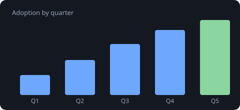

## What this is

This paragraph lives in `content.md` and is rendered in the browser by `app.js`
with a **tiny inline Markdown parser** — no libraries, no build step. It's here to
show that a presentation can be **content-driven**: write Markdown, ship a folder.

## Images work too

Drop an image in the folder and reference it with a **relative** path —
`` renders as:

Remote images (`https://…`) work as well; relative keeps the presentation
self-contained and portable under any base path.

## Why it's useful

- Compile research or a proposal into a shareable little site.
- Keep the writing in Markdown; keep the look in `style.css`.
- Everything is **relative and self-contained**, so it works at `/p/<slug>/`
  under any base path — and offline.

## How to make your own

Duplicate this `_example/` folder, rename it to your slug, and edit:

- `index.html` — structure
- `style.css` — look
- `app.js` — behaviour (or delete it and write plain HTML)
- `content.md` — the words

Push, and it's live at `/p/<your-slug>/`. See the [presentations README](https://github.com/seenthis-ab/product-roadmap/blob/main/presentations/README.md)
for the full convention.
